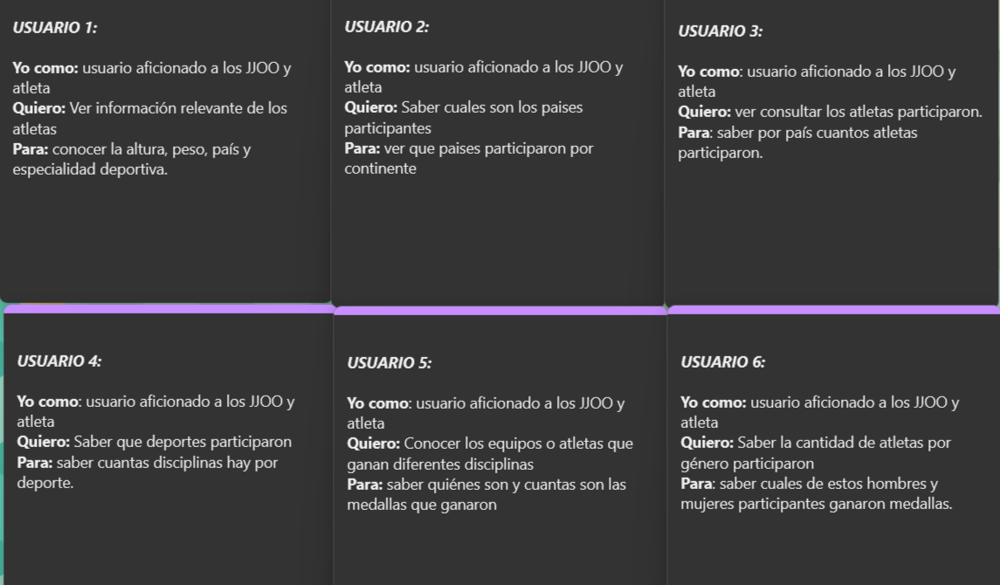

# Readme del proyecto Data Lovers
Por Nataly Escobar, Camila Cortés
___
## Definición del producto en base al conocimiento del usuario:
- ¿Quiénes son los principales usuarios de producto?
Se identificó dos tipos de usuarios que podrían hacer uso de la página:
    * Aficionados a los Juegos Olimpicos.
    * Atletas que quieran ver el desempeño de sus competidores.
- ¿Cuáles son los objetivos de estos usuarios en relación con el producto?
Los principales objetivos de los usuarios con el producto son:
    * Para los atletas, ver las estadísticas de sus contrincantes.
    * Saber que atletas participaron.
    * Conocer las características especificas de cada atleta como peso, altura, país y especialidad deportiva .
    * Poder ver que países participaron por continente.
    * Saber cuantas disciplinas hay por deporte.
    * Saber quienes participaron y cuantas medallas ganaron.
    * Saber cuantos fueron los participantes por género y cuantos de ellos ganaron medallas. 
- ¿Cuáles son los datos más relevantes que quieren ver en la interfaz y por qué?
    * Acceder a toda la información de cada deportista (Peso, altura, país, deporte que practica). Porque en el caso del los contrincantes es importante conocer a sus oponentes.
    * Ver que países participaron en los Juegos Olímpicos de Río y si es posilble clasificarlos por continente. Porque les interesa saber si Latinoamérica tuvo poca o mucha representación. 
    * Ver cuantos atletas participaron y de ser posible mostrar cuantos atletas participaron por país. Por ejemplo, como colombianos nos gustaría conocer todos los atletas colombianos que participaron. 
    * Saber cuantas disciplinas hay por deporte porque es importante para los atletas saber en cuales de estas disciplinas podría participar. 
    * Conocer a los equipos y atletas que ganaron medalla de acuerdo a su disciplina porque así otros atletas pueden ver su experiencia y los aficionados podrían escoger a su deportista favorito por disciplina. 
    * Ver cuantos atletas de cada género participaron y cuantos ganaron medalla porque les gustaría identificar si hay igualdad de género en cuanto a la participación de mujeres. 
- ¿Cuándo utilizan o utilizarían el producto?
  Este producto lo utilizarían cuando vuelvan a haber otros Juegos Olímpicos para comparar el rendimiento de los deportistas cada año, para motivar a los atletas a mejorar las marcas de estos Juegos Olímpicos, por cultura general (que país ganó mas medallas, que disciplinas participaron, cuantos atletas participaron), por ver que atletas nuevos hay, por diversión y curiosidad. 
- Historias de Usuario:
  De acuerdo a nuestra investigación determinamos las siguientes historias de usuario:
  
- Criterios de aceptación:
    * Historia de usuario 1: 
    * * El usuario puede acceder a las características de cada deportista (Peso, altura, país, deporte que practica) por medio de un ícono que al hacer click y ver toda la información en una tabla.
    * * Tener un filtro para que el usuario pueda ver los atletas que participaron por país.
    * Historia de usuario 2:
    * * El usuario puede acceder a los países que participaron por medio de un ícono que al hacer click y ver toda la información en una tabla.
    * * Tener un filtro que permita al usuario clasificar los países por continente.