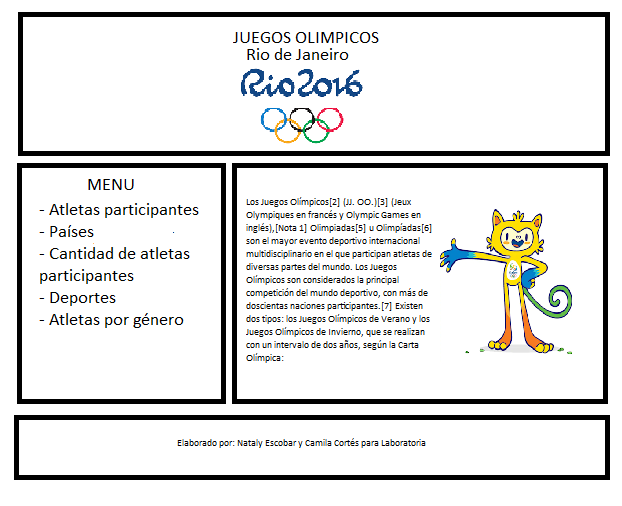
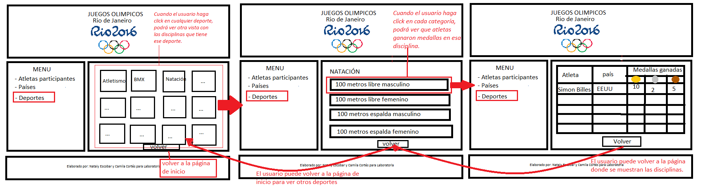

# Readme del proyecto Data Lovers
Por Nataly Escobar, Camila Cortés
___
## Definición del producto en base al conocimiento del usuario:
- ¿Quiénes son los principales usuarios de producto?
Se identificó dos tipos de usuarios que podrían hacer uso de la página:
    * Aficionados a los Juegos Olimpicos.
    * Atletas que quieran ver el desempeño de sus competidores.
- ¿Cuáles son los objetivos de estos usuarios en relación con el producto?
Los principales objetivos de los usuarios con el producto son:
    * Para los atletas, ver las estadísticas de sus contrincantes.
    * Saber que atletas participaron.
    * Conocer las características especificas de cada atleta como peso, altura, país y especialidad deportiva .
    * Poder ver que países participaron por continente.
    * Saber cuantas disciplinas hay por deporte.
    * Saber quienes participaron y cuantas medallas ganaron.
    * Saber cuantos fueron los participantes por género y cuantos de ellos ganaron medallas. 
- ¿Cuáles son los datos más relevantes que quieren ver en la interfaz y por qué?
    * Acceder a toda la información de cada deportista (Peso, altura, país, deporte que practica). Porque en el caso del los contrincantes es importante conocer a sus oponentes.
    * Ver que países participaron en los Juegos Olímpicos de Río y si es posilble clasificarlos por continente. Porque les interesa saber si Latinoamérica tuvo poca o mucha representación. 
    * Ver cuantos atletas participaron y de ser posible mostrar cuantos atletas participaron por país. Por ejemplo, como colombianos nos gustaría conocer todos los atletas colombianos que participaron. 
    * Saber cuantas disciplinas hay por deporte porque es importante para los atletas saber en cuales de estas disciplinas podría participar. 
    * Conocer a los equipos y atletas que ganaron medalla de acuerdo a su disciplina porque así otros atletas pueden ver su experiencia y los aficionados podrían escoger a su deportista favorito por disciplina. 
    * Ver cuantos atletas de cada género participaron y cuantos ganaron medalla porque les gustaría identificar si hay igualdad de género en cuanto a la participación de mujeres. 
- ¿Cuándo utilizan o utilizarían el producto?
  Este producto lo utilizarían cuando vuelvan a haber otros Juegos Olímpicos para comparar el rendimiento de los deportistas cada año, para motivar a los atletas a mejorar las marcas de estos Juegos Olímpicos, por cultura general (que país ganó mas medallas, que disciplinas participaron, cuantos atletas participaron), por ver que atletas nuevos hay, por diversión y curiosidad. 
## Historias de Usuario:
  
  De acuerdo a nuestra investigación determinamos las siguientes historias de usuario definidas en nuestro trello:
  [Link a trello ](https://trello.com/b/ZULAlmGg/proyecto-data-lovers-nataly-escobar-camila-cort%C3%A9s)

## Criterios de aceptación:
Historia de usuario 1:
* El usuario puede acceder a la tabla con la información de los deportistas (Peso, altura, país, deporte que practica) por medio de un link (atletas participantes).
* El usuario puede ver a la cantidad de atletas que participaron en los Juegos Olímpicos de Río.
Historia de usuario 2:
* Que el usuario pueda acceder a un select con los países participantes en los JJOO.
* Que el usuario al seleccionar una opción (país) refleje los atletas que participaron de ese país.
Historia de usuario 3:
* Que el usuario pueda acceder a un select con los géneros participantes en los JJOO.
* Que el usuario al seleccionar una opción (género) refleje los atletas que participaron de ese género.
Historia de usuario 4:
* Que el usuario pueda acceder a unas tarjetas que contienen una imagen con los deportes por medio de un link (Deportes participantes)
Historia de usuario 5:
* Que el usuario al seleccionar una opción (deporte)  refleje las disciplinas que participaron en los JJOO. 
Historia de usuario 6:
* Que el usuario al seleccionar una disciplina deportiva refleje en una tabla los deportistas que ganaron medallas. 

## Definición de terminado

Se acordaron las mismas definiciones de terminado para todas las historias de usuarios, estas se mutrarán a continuación:
* Está la estructura HTML
* Cumple con las guías de diseño aprobadas (CSS).
* Las funciones en el JS cumplen con su tarea.
* Se ve reflejado en el DOM las funciones.
* Se realizaron los testeos de usabilidad y recibimos feedback.
* Las pruebas unitarias dan una cobertura del 70% de statements (sentencias), functions (funciones), lines (líneas), y branches (ramas).del archivo src/data.js y son aprobadas.
* Se hizo pair programming.
* El código esta en la rama main del repositorio de ambas.

## Proceso de diseño

Algo que no tuvimos en cuenta a la hora de hacer las historias de usuario fue preguntar si les gustaría tener un contexto o información en general de los Juegos Olímpicos de Río como cual fue la mascota representativa, en que días se realizó y cuantos eventos deportivos tuvo. Volvimos a preguntarles y ellos dijeron que estaban de acuerdo ya que muchas personas querian saber esta información antes de ver que deportistas participaron. 

A continuación se mostrarán los prototipos de las páginas que contendrán los criterios:

 * Página principal:

  

 * Información sobre atletas: 
 
    
 
 * Deportes participantes:
  
   

A continuación se mostrará el prototipo de alta fidelidad realizado en Adobe XD.
[Link al prototipo](https://xd.adobe.com/view/3386d29a-8aa3-470b-a1f6-ca8900976f9d-66d5/)

